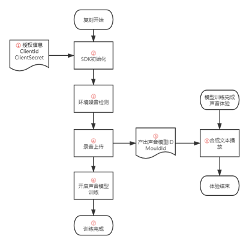
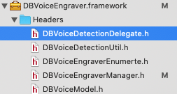

[TOC]

## 1. 复刻流程说明：

1. 整个复刻体验闭环包含两个模块，一个模块是录音上传服务器进行声音模型训练，产出声音模型ID，另一个模块是根据声音模型ID去合成服务器合成，产出声音文件，播放声音文件完成体验。
2. 此（复刻）SDK仅支持第一个模块的功能，即②③④⑤⑥⑦等功能。第二个体验的模块⑧，我们提供2种集成方式供选择，以便实现实际项目中的需求。参考3.6的说明。

## 2. XCode集成lib（参考demo） 

### 2.1 兼容性说明
兼容性：系统：iOS 8以上版本     CPU架构：arm64 arm64e armv7 armv7s
添加隐私麦克风权限：Privacy - Microphone Usage Description：使用麦克风检测声音

### 2.2 将framework添加到项目project的目录下面

### 2.3 引用SDK的头文件

`#import <DBVoiceEngraver/DBVoiceEngraverManager.h>`// 声音复刻头文件

`#import <DBVoiceEngraver/DBVoiceDetectionUtil.h>` //噪声检测头文件

SDK关键类：

| 类接口名称 | 说明 |
|--------|--------|
|DBVoiceDetectionUtil.h| 声音检测工具类，负责噪声检测 |
|   DBVoiceDetectionDelegate.h     |   回调声音检测的结果和录音时音量的结果    |
|     DBVoiceEngraverEnumerte.h   |  包含复刻SDK中的错误枚举      |
|     DBVoiceModel   |    复刻成功后返回的声音模型    |
|   DBVoiceRecognizeModel     |    返回上传声音后的识别结果    |

## 3.调用方法说明
### 3.1 开启声音复刻的流程
1. 实例化DBVoiceDetectionUtil检测噪声,并遵守相关代理，在代理回调中处理噪声检测的结果；
2. 点击开始复刻，并获取复刻文本，获取成功后进入朗读文本页面；
3. 实例化DBVoiceEngraverManager单例对象，并传入文本开始声音复刻；
4. 开始朗读文本；
5. 结束朗读文本；
6. 上传文本并进行准确率识别；
7. 录制完成，填入相关信息并开始录制；
8. 根据queryId 或者modelId 获取复刻后的声音；
9. 选择相应的声音模型进行声音体验;

### 3.2 回调block参数说明
| 名称 | 参数 |说明 |
|--------|--------|--------|
|    DBSuccessHandler    |   NSDictionary *dict     |   成功的回调，以字典的形式回调结果，此处回调为服务端返回的数据     |
|   DBVoiceRecogizeHandler     |   DBVoiceRecognizeModel *model     | 识别成功的回调 status：1：上传识别成功；0：上传识别失败; percent: 声音的准确率       |
|   DBTextBlock     |  NSArray <NSString *> *textArray      |    获取需要朗读的文本    |
|    DBSuccessModelHandler    |    NSArray<DBVoiceModel *> *array    |       获取训练成功的声音模型Id
 |
|    DBSuccessOneModelHandler    |    DBVoiceModel *model    |modelStatus：2：录制中 3：启动训练失败 4：训练中 5： 训练失败 6： 训练成功 modelId: 模型Id，每个声音对应一个模型Id modelStatus:模型状态    |
|    DBFailureHandler    |   NSError *error     |   错误信息     |

### 3.3 DBVoiceDetectionDelegate说明

| 方法名称 | 参数说明 |
|--------|--------|
|    - (void)dbDetecting:(NSInteger)volumeDB    |    回调声音检测到的分贝值volumeDB：检测到音量的分贝值    |
| - (void)dbDetectionResult:(BOOL)result value:(NSInteger)volumeDB   |       噪声检测的最终结果回调 result: 1：检测成功 0：检测失败 volumeDB:检测到音量的分贝值|

### 3.4 DBVoiceDetectionUtil的调用说明

| 方法名称 | 使用说明 |
|--------|--------|
|  -(DBErrorState)startDBDetection      |   1.遵循相关的代理，并实现相关的代理方法； 2.开启噪声检测，如果开启成功，返回值为DBErrorStateNOError;     |

### 3.5 DBVoiceEngraverManager的调用说明

| 方法名称 | 使用说明 |
|--------|--------|
|   - (void)setupWithClientId:(NSString *)clientId clientSecret:(NSString *)clientSecret queryId:(nullable NSString * )queryId SuccessHandler:(DBSuccessHandler)successHandler failureHander:(DBFailureHandler)failureHandler     |   1.设置clientId,clientSecret;queryId，successHandler，failureHandler初始化的时候设置；2.queryId为可选项，可以通过它来批量查询复刻后的modelId; 3.clientId,clientSecret为授权信息，需联系标贝公司获取  4.successHandler回调结果，默认为空 5. failureHandler：回调失败结果     |
|- (void)getRecordTextArrayTextHandler:(DBTextBlock)textHandler failure:(DBFailureHandler)failureHandler| 获取复刻的文本 textHandler：以数组的形式回调文本数据； failureHandler：回调失败结果|
|- (void)setupQueryId:(nullable NSString *)queryId| 设置查询Id，需要在执行获取sessionId前设置，此参数不是必填参数，但是强烈建议使用 queryId： 查询Id|
|- (void)startRecordWithText:(NSString *)text failureHander:(DBFailureHandler)failureHandler|传入识别文本并开启录音,默认添加了一个120s时长的录音限制；failureHandler：如果发生错误，回调此方法|
|- (void)pauseRecord;|结束录音，结束本次录音|
|- (void)unNormalStopRecordSeesionSuccessHandler:(DBSuccessHandler)successBlock failureHandler:(DBFailureHandler)failureHandler|非正常录音结束，如果用户没录音完返回需要调用此方法结束录音，不然会默认占用一个录音权限，如果长时间未调用，也会自动释放；successBlock：结束录音成功的回调；failureHandler：如果发生错误，回调此方法|
|- (void)uploadRecordVoiceRecogizeHandler:(DBVoiceRecogizeHandler)successHandler |上传录音文件进行识别successHandler：识别成功 1、如果发生错误，回调代理方法- (void)dbVoiceRecognizeError:(NSError *)error|
|- (void)queryModelStatusByModelId:(NSString *)modelId SuccessHandler:(DBSuccessModelHandler)successHandler failureHander:(DBFailureHandler)failureHandler|根据默认传入的modelId查询模型状态successHandler：查询成功，以数组的形式返回model failureHandler：如果发生错误，回调此方|
|- (void)startModelTrainRecordVoiceWithPhoneNumber:(NSString * _Nullable)phoneNumber                              notifyUrl:(NSString *_Nullable)notifyUrl                          successHandler:(DBSuccessHandler)successHandler failureHander(DBFailureHandler)failureHandler|开启模型训练；phoneNumber：手机号码 notifyUrl：用于接收复刻结果的回调url successHandler:开启训练成功，开启成功后会回调modelId failureHandler：如果发生错误，回调此方法|

### 3.6 体验复刻成功或的声音

第一种集成方式如Demo中所示，用声音模型ID + RestAPI的形式，合成MP3声音文件，进行播放。这种合成方式适用于单次不超过250字文本长度的文本合成。
另一种方式则是声音模型ID + TTS合成SDK，具体集成方式可参考我们TTS合成SDK的接入文档。这种方式无文本长度限制，实时合成流式返回，TTS合成SDK中也有播放器功能，集成使用很方便。

## 4.错误码说明
| 错误码 | 枚举状态 |含义 |
|--------|--------|--------|
|   0   | DBErrorStateNOError  |   成功     |
|   1000   | DBErrorStateMircrophoneNotPermission  |   麦克风没有权限     |
|1001|  DBErrorStateInitlizeSDK|初始化SDK失败|
|1002|DBErrorStateFailureToAccessToken|获取token失败|
|1003|DBErrorStateFailureToGetSession|获取session失败|
|1004|DBErrorStateFailureInvalidParams|无效的参数|
|99999|DBErrorStateNetworkDataError|获取网络数据异常|

